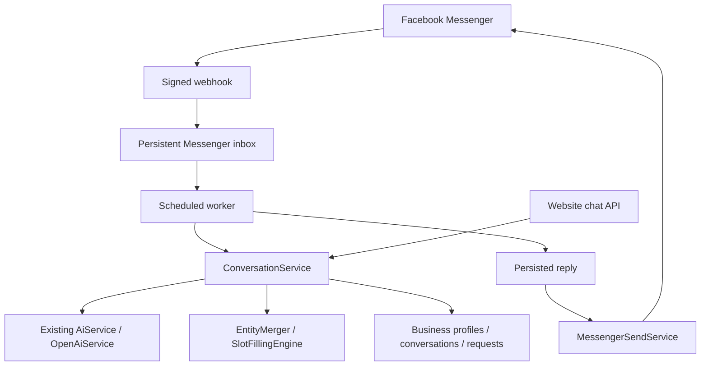

# Inquiro

Inquiro, by Vorlent Labs, is an AI receptionist for small businesses: answer customer questions, collect booking details, and route requests for confirmation. The initial target industries are hotels, restaurants, and clinics.

This repository contains the Spring Boot backend, with the Messenger integration and Business Knowledge MVP implemented locally. It is **not yet the complete commercial SaaS MVP**. See [IMPLEMENTATION_CHECKLIST.md](IMPLEMENTATION_CHECKLIST.md) for the evidence-based inventory and remaining work.

## What works here

- AI intent/entity extraction, contextual follow-ups, explicit corrections, configured missing-field questions, and business knowledge answers.
- Persistent business profiles, channel mappings, conversation state, and business requests awaiting confirmation/review.
- Persistent knowledge management, transient AI FAQ suggestions, explicit operator approval/rejection, and mixed knowledge/workflow messages.
- Messenger verification, raw-body signature checks, all text events in each batch, durable receipt before acknowledgment, duplicate protection, saved replies, retryable delivery, and optional typing/seen indicators.
- Scoped conversation identity: business + channel + external Page/site + customer. Website chat and Messenger share the same conversation service.
- Website message/reset endpoint compatibility. No frontend source, landing page, localStorage code, or browser daily-limit code is present in this checkout.

Availability currently means that a configured service is offered; it does **not** represent inventory. A completed conversation creates a business request, not an automatically confirmed reservation. Natural dates remain phrases until the inventory/date-normalization milestone.

## Architecture and stack

Java 17 target; Spring Boot 3.5.15-SNAPSHOT; Spring MVC, Spring Data JPA, Jackson, Lombok; H2 development database; Maven; OpenAI via Spring RestClient.



The webhook performs no AI calls. The worker saves conversation updates and its reply in one database transaction, then sends the saved reply in a separate transaction. Delivery retries do not repeat AI processing or create another business request.

## Run locally

Install a JDK (17 or newer), set `JAVA_HOME`, and configure environment variables in your shell or IDE run configuration. Spring does not automatically load `.env`; [.env.example](.env.example) lists placeholders only.

Windows PowerShell:

```powershell
.\mvnw.cmd test
.\mvnw.cmd package
java -jar target/inquiro-backend-0.0.1-SNAPSHOT.jar
```

macOS/Linux:

```sh
./mvnw test
./mvnw package
java -jar target/inquiro-backend-0.0.1-SNAPSHOT.jar
```

An installed Maven can also run `mvn test` and `mvn package`. The app starts without channel/AI credentials; corresponding external features require configuration. Credentials must never be passed in URLs or committed to Git.

## Environment variables

| Variable | Purpose / default |
| --- | --- |
| `OPENAI_API_KEY` | AI credential; legacy `INQUIRO_OPENAI_API_KEY` also accepted |
| `OPENAI_MODEL` | Defaults to `gpt-4.1-mini` |
| `FACEBOOK_VERIFY_TOKEN` | Random verification token; legacy `INQUIRO_MESSENGER_VERIFY_TOKEN` accepted |
| `FACEBOOK_PAGE_ACCESS_TOKEN` | Token for the configured Page; legacy `INQUIRO_MESSENGER_ACCESS_TOKEN` accepted |
| `FACEBOOK_PAGE_ID` | Numeric Facebook Page ID, required for Messenger |
| `FACEBOOK_APP_SECRET` | Meta App Secret for validating POST signatures |
| `FACEBOOK_GRAPH_API_VERSION` | Defaults to existing `v26.0`; set the version supported by your Meta app |
| `INQUIRO_MANAGEMENT_API_KEY` | Long random operator key for management API access |
| `INQUIRO_AUTH_SESSION_TTL_HOURS` | Business-user access-token lifetime; defaults to 24 hours (1–744) |
| `INQUIRO_RATE_LIMIT_ENABLED` | Enables backend rate limiting; defaults to `true` |
| `INQUIRO_RATE_LIMIT_REQUESTS_PER_MINUTE` | Anonymous API requests per IP/minute; defaults to 60 |
| `INQUIRO_RATE_LIMIT_AUTHENTICATED_REQUESTS_PER_MINUTE` | Authenticated API requests per user/minute; defaults to 120 |
| `INQUIRO_RATE_LIMIT_PUBLIC_AI_REQUESTS_PER_MINUTE` | Public AI chat requests per IP/minute; defaults to 20 |
| `INQUIRO_RATE_LIMIT_AUTH_REQUESTS_PER_MINUTE` | Login/register attempts per IP/minute; defaults to 10 |
| `INQUIRO_RATE_LIMIT_WEBHOOK_REQUESTS_PER_MINUTE` | Meta webhook requests per IP/minute; defaults to 120 |
| `INQUIRO_MAX_REQUEST_BODY_BYTES` | Generic HTTP request Content-Length ceiling; defaults to 1 MiB |
| `OPENAI_CONNECT_TIMEOUT_SECONDS` | OpenAI connection timeout; defaults to 5 seconds |
| `OPENAI_READ_TIMEOUT_SECONDS` | OpenAI response timeout; defaults to 30 seconds |
| `OPENAI_MAX_CONCURRENT_REQUESTS` | Maximum in-process concurrent OpenAI calls; defaults to 8 |
| `DEFAULT_BUSINESS_ID` | Defaults to `biz_001` |
| `WEBSITE_CHANNEL_ID` | Defaults to `website-default` |
| `SEED_DEFAULT_BUSINESS` | Defaults to `true`; seeds missing default account and configured channel mappings |
| `MESSENGER_WORKER_ENABLED` | Defaults to `true`; use only one active worker instance for this milestone |
| `PORT` | Defaults to `8080` |
| `FORWARD_HEADERS_STRATEGY` | Defaults to `none`; set `native` only behind a trusted proxy which sanitizes headers |
| `DATABASE_URL` | JDBC URL; defaults to `jdbc:h2:file:./data/inquiro` |
| `DATABASE_USERNAME`, `DATABASE_PASSWORD` | Default development values: `sa`, blank password |
| `DATABASE_DDL_AUTO` | Defaults to `update` for development |
| `H2_CONSOLE_ENABLED` | Defaults to `false` |

Optional legacy WhatsApp settings are listed in `.env.example`. Its App Secret can be set with `WHATSAPP_APP_SECRET`; otherwise `FACEBOOK_APP_SECRET` is used.

Business users register and log in with `/api/auth/register` and `/api/auth/login`. Passwords use BCrypt; login returns a cryptographically random opaque Bearer token, while only its SHA-256 hash is persisted. Send the token in `Authorization: Bearer <token>` to access business-management APIs. Tokens expire and `POST /api/auth/logout` revokes them.

Each authenticated business user is checked against a `BusinessMembership` for the business ID in the request. Owners and admins may operate their own business; only owners can view members or add an already-registered user as an admin. This prevents tenant access by URL manipulation.

The operator key remains a temporary internal bypass for `/api/business/**`, `/api/knowledge/**`, `/api/test/**` and the optional H2 console. Supply it in `X-Inquiro-Management-Key`. It is not a customer credential and must never be embedded in public frontend code. `POST /api/knowledge/ingest` and `/api/test/**` remain operator-only.

## Configure a business for the demo

Startup preserves existing business data. The repository's legacy default profile is a vehicle-service example; it is not silently replaced with a hotel.

Use `PUT /api/business/accounts/{businessId}/profile` to configure the full profile, including authoritative knowledge and service definitions. [examples/hotel-profile.json](examples/hotel-profile.json) is a fictional hotel fixture with room booking and airport pickup. Replace its facts with verified owner information before a real demonstration.

```powershell
$headers = @{ 'X-Inquiro-Management-Key' = $env:INQUIRO_MANAGEMENT_API_KEY }
$profile = Get-Content examples/hotel-profile.json -Raw
Invoke-RestMethod -Method Put -Uri 'http://localhost:8080/api/business/accounts/biz_001/profile' -Headers $headers -ContentType 'application/json' -Body $profile
```

Required slots and customer-facing questions come from each `RequestDefinition`. Restaurant and healthcare profiles can configure `TABLE_RESERVATION`, `BUFFET_RESERVATION`, and `DOCTOR_APPOINTMENT` in the same format. Real table/doctor/room inventory is still pending.

When seeding is enabled, `FACEBOOK_PAGE_ID` is mapped to `DEFAULT_BUSINESS_ID` if the Page has no existing mapping. Existing Page ownership is not overwritten. Verify the mapping with `GET /api/business/accounts/{businessId}/channels` before subscribing the Page. With seeding disabled, create the account and channel through the protected management endpoints.

## Connect Facebook Messenger

1. In the existing **Inquiro AI** Meta app, configure the Page ID, Page Access Token, verify token, App Secret, and Graph API version in the backend environment. Restart after changing them.
2. Expose the backend through a public **HTTPS** URL using your hosting platform or a development tunnel. HTTPS terminates at the trusted ingress; local Spring HTTP can remain private behind it.
3. Set the Messenger callback URL to `https://YOUR-BACKEND/webhook`. `/messenger/webhook` remains a compatible explicit Messenger URL.
4. Enter the same verify token as `FACEBOOK_VERIFY_TOKEN`. The GET handshake requires `hub.mode=subscribe`, the matching token, and `hub.challenge`; invalid verification returns 403.
5. Subscribe the app/Page to message events and enable the necessary Page messaging access. Confirm test-user/app-role eligibility in development mode; public access requires the applicable Meta review/access configuration.
6. Send a text message to that Facebook Page from a real eligible account. Check for an Inquiro reply and the `messenger_reply_sent` log event.
7. Test a follow-up, correction, knowledge question and another follow-up. An unfinished booking should survive the knowledge question.

The Send API uses `POST /{version}/{pageId}/messages`, a bearer token and `messaging_type: RESPONSE`. See [Meta's maintained Messenger API collection](https://www.postman.com/meta/messenger-platform-api/documentation/iyp204x/messenger-platform-api) for its request contract. Follow the app's current messaging-window and permission requirements; Inquiro does not bypass Meta restrictions.

POST bodies are checked against `X-Hub-Signature-256` using the App Secret before processing. Unsigned requests are rejected even in development. A valid verify token is not a substitute for a POST signature. The shared `/webhook` also preserves existing WhatsApp routing by object type; its explicit route is `/whatsapp/webhook`.

Only the configured Messenger Page's token is used. Events from unknown, disabled, or unconfigured Pages are ignored. Multiple business records and isolated conversation keys exist, but self-service authorization and per-tenant token storage are future work.

## Website compatibility and REST endpoints

The existing message payload remains unchanged:

```http
POST /api/conversations/message
Content-Type: application/json

{"sessionId":"browser-generated-session-id","message":"I need a room in Paris"}
```

Responses retain `inquiry`, `missingFields`, `status`, and `reply`. `DELETE /api/conversations/{sessionId}` resets only the configured website conversation. `POST /api/chat` remains available as a stateless endpoint and now reads the latest persisted default-business profile when present.

| Endpoint | Purpose |
| --- | --- |
| `GET/POST /webhook` | Shared Meta callback, including Messenger |
| `GET/POST /messenger/webhook` | Explicit Messenger callback |
| `GET/POST /whatsapp/webhook` | Explicit legacy WhatsApp callback |
| `POST /api/conversations/message` | Stateful website chat |
| `DELETE /api/conversations/{sessionId}` | Website reset |
| `POST /api/chat` | Existing stateless chat |
| `POST /api/auth/register`, `POST /api/auth/login`, `POST /api/auth/logout` | Business-user account and opaque access-session lifecycle |
| `POST /api/business/accounts` | Create business account; authenticated creator becomes OWNER (operator key remains supported) |
| `GET/PUT /api/business/accounts/{id}/profile` | Read/update profile |
| `GET/PUT /api/business/accounts/{id}/knowledge` | Read/replace the complete knowledge object |
| `POST /api/business/accounts/{id}/knowledge/faq-suggestions` | Generate up to 10 transient drafts from configured knowledge |
| `POST /api/business/accounts/{id}/knowledge/faq-suggestions/review` | Explicitly approve/edit or reject a FAQ draft |
| `POST /api/knowledge/ingest` | Merge operator-supplied information into an existing persisted profile |
| `GET/POST /api/business/accounts/{id}/channels` | Read/add channel mapping |
| `GET/POST /api/business/accounts/{id}/members` | Owner-only membership listing and adding an existing user as ADMIN |
| `GET /api/business/requests?businessId=...` | Requests for a business |
| `GET /api/business/requests/pending?businessId=...` | Pending requests |
| `POST /api/business/requests/{id}/confirm` or `/reject` | Existing manual request decision |
| `GET /api/business/accounts/{id}/messenger/events?status=FAILED` | Last 50 event summaries for the business |
| `POST /api/business/accounts/{id}/messenger/events/{eventId}/retry` | Retry a failed event after resolving its configuration/error |

The browser's existing localStorage identifier can still be sent unchanged. Historical unscoped database conversation rows are retained but not reused: their tenant/channel provenance cannot be established safely. In-progress legacy conversations therefore start afresh once after this update. New sessions persist with explicit scope metadata. Existing local database files are not migrated destructively or included in implementation commits.

## Delivery operations and limitations

- All text events in all entries are inspected. Echoes, receipts, attachments and malformed events are ignored safely.
- Deduplication uses Page + message ID and a unique database constraint. If the ID is absent, a timestamp/sender/text fallback is used. Without both ID and timestamp, duplicate detection cannot be guaranteed.
- The scheduled worker consumes at most 20 eligible rows per poll. Use **one worker instance** to preserve conversation ordering; distributed per-conversation ordering is not yet implemented.
- AI failures produce a friendly saved reply. Seen/typing failures do not prevent a reply attempt.
- Send failures retry with backoff, up to five attempts. Permanent HTTP errors and exhausted retries become `FAILED`; operators can inspect safe summaries and retry after correcting the cause.
- A crash after Meta accepted a reply but before the database recorded success can cause an outbound duplicate. There is no atomic transaction spanning Meta and the database. This implementation does not claim exactly-once external delivery.
- Replies are bounded to 2,000 Unicode code points. Incoming text is bounded to 10,000 characters; webhook bodies are bounded to 1 MiB at the controller. Enforce a request-body limit at the ingress too.
- Logs contain request/event identifiers and status, not tokens, verification query strings or raw customer messages. Inbox/conversation records contain customer data; restrict database access and define retention before onboarding real customers.
- Manual business-decision notifications use the original Messenger identity; website requests are never sent as Messenger messages. These legacy decision notifications are best effort and are not in the webhook reply retry queue.

## Tests and validation

`mvn test` uses an isolated in-memory H2 database and mocked external HTTP; no real credentials or messages are required. Coverage includes AI JSON parsing, contextual multi-field extraction/merging, correction handling, question interruption, Page/channel isolation, webhook verification/signatures, batch parsing, Send API requests, concurrent deduplication, durable reply retry, operator access, notification routing, and website reset compatibility.

See [VALIDATION.md](VALIDATION.md) for actual build and smoke-test results. Real Meta delivery is a separate external acceptance check; a mocked send test does not prove it.

## Phase 44 — Production API and abuse protection

Phase 44 adds backend controls that protect public/customer-facing APIs and the AI dependency from accidental overload, brute-force traffic, and runaway request cost.

### Request and API protection

- A centralized servlet filter applies configurable per-minute limits.
- Anonymous traffic is keyed by source IP; authenticated business traffic is keyed by the authenticated user ID.
- Public AI endpoints (`/api/chat` and `/api/conversations/**`) use a stricter default of 20 requests/minute per source IP.
- Login and registration use a separate 10 requests/minute per source IP limit to reduce credential-stuffing and account-creation abuse.
- Meta webhook routes use their own higher delivery limit and retain their existing signature, Page ownership, deduplication, and 1 MiB webhook checks.
- Generic requests with a declared `Content-Length` above the configured 1 MiB default are rejected with HTTP 413.
- Rate-limited responses return HTTP 429 with `Retry-After`.
- CORS preflight requests are not charged against the limiter.
- Rate limiting is disabled explicitly only with `INQUIRO_RATE_LIMIT_ENABLED=false`.

### AI cost and failure protection

- OpenAI connection and read timeouts are configurable rather than hard-coded.
- OpenAI calls are protected by an in-process concurrency semaphore so a traffic spike cannot create an unbounded number of simultaneous upstream requests.
- The existing design deliberately does not retry failed OpenAI requests automatically; this prevents a transient upstream failure from multiplying AI spend.
- Public AI endpoints have a separate request budget from ordinary APIs.
- Existing message and webhook payload bounds remain in force, so Phase 44 builds on rather than replaces the earlier transport limits.

### Scaling boundary

The default rate limiter is intentionally dependency-free and in-memory. Its state is local to one application instance and resets on restart. It is therefore suitable for the current single-instance pilot. A distributed `RateLimitStore` (for example Redis-backed) should replace the store implementation in the horizontal-scaling milestone rather than being introduced prematurely into the core application.

## Phase 42/43 — Real availability, booking, and booking reliability

Phase 42/43 replaces the remaining request-only booking path with persistent, inventory-aware bookings and a transactional booking lifecycle.

### Availability and inventory

- Booking inventory is configured per business and service with an explicit capacity.
- Time-slot services use overlapping active bookings against configured capacity.
- Date-range services use check-in/check-out overlap against configured capacity.
- Business operating hours are checked before inventory.
- No inventory configuration means availability cannot be confirmed; Inquiro does not invent capacity.
- The authenticated business API can configure inventory through `PUT /api/business/accounts/{businessId}/booking-inventory`.

### Booking lifecycle

- Completed conversational BOOKING requests now create a real `BookingEntity` and return a booking reference.
- Direct business booking creation is available through the authenticated booking API.
- Booking cancellation is transactional and tenant-scoped.
- Temporary booking holds are supported with an expiration timestamp.
- A scheduled job expires due holds automatically.
- Active HOLD bookings reserve inventory; CANCELLED and EXPIRED bookings do not.
- Hotel stays use date ranges and duration; point-in-time services use date/time slots.

### Reliability

- Booking creation is transactional.
- The business row is pessimistically locked before availability is checked and the booking is inserted, serializing competing bookings for the same business.
- Idempotency keys are persisted with a unique database constraint and return the original booking on safe retries.
- Cross-business reuse of an idempotency key is rejected.
- Inventory capacity is evaluated while the business booking transaction is protected by the business lock.
- Booking state transitions reject invalid cancellation attempts.
- Database migration `V3__booking.sql` creates booking and inventory persistence.

Spring Data JPA supports pessimistic locking through `@Lock`; the existing business repository uses a pessimistic-write lookup so the availability check and insert occur inside the same booking transaction. citeturn0search0

## Phase 41 — Meta channel credential security

Phase 41 moves Messenger Page credentials out of application configuration and into encrypted, business-owned channel credentials:

- Messenger Page access tokens, app secrets, and verification tokens are encrypted at rest with AES-256-GCM.
- Credentials are stored in the `channel_credential` table keyed to the business channel; plaintext secrets are never returned by the API.
- Credential replacement rotates the encrypted value and records a key version; DELETE revokes the stored credentials.
- A current and optional previous encryption key can coexist during key rotation. After re-encrypting all credentials, the previous key can be removed.
- Messenger webhook signatures are resolved from the recipient Page's configured credentials before the event is accepted.
- Messenger outbound delivery resolves the access token by Page/channel, preventing one Page credential from being used for another Page.
- Credential status endpoints expose only whether credentials are configured.
- Customer-facing channel credentials are never accepted through the management key.
- Production must set `INQUIRO_CREDENTIAL_ENCRYPTION_KEY` to a base64-encoded 32-byte AES-256 key and keep it in a secret manager.

Key rotation procedure:

1. Set the new key as `INQUIRO_CREDENTIAL_ENCRYPTION_KEY`.
2. Set the previous key as `INQUIRO_CREDENTIAL_ENCRYPTION_KEY_PREVIOUS`.
3. Update each channel's credentials through the authenticated owner/admin endpoint. Updated credentials are encrypted with the current key.
4. Verify all channels have been rotated, then remove the previous key.

## Phase 40 — Production security and multi-tenancy hardening

Phase 40 makes tenant authorization the normal security boundary for business-management APIs:

- Business endpoints no longer accept the management key as a tenant-access bypass.
- Business users authenticate with the existing opaque bearer session.
- Every business-scoped management operation checks membership for the requested `businessId`.
- Owner and admin roles can perform tenant business writes; membership administration remains owner-only.
- Unauthenticated/unknown application routes are denied instead of falling through to public access.
- CORS is disabled for cross-origin browser calls by default and can be explicitly configured with `INQUIRO_SECURITY_ALLOWED_ORIGINS`.
- Security response headers include content-type protection, referrer-policy, and HSTS.
- Regression tests cover tenant isolation, admin permissions, management-key bypass prevention, and deny-by-default routing.

The management key remains an operator mechanism for the explicitly internal/test surface. It is not a business tenant credential and must not be exposed to customer browsers.

## Phase 39 — PostgreSQL production database

Phase 39 adds a production database foundation without changing the application-level repository contracts:

- PostgreSQL JDBC driver and Flyway migrations are included.
- `src/main/resources/db/migration/V1__baseline_postgresql.sql` defines the current persistent schema for business accounts/channels, conversations, requests, authentication sessions/users/memberships, and the Messenger inbox.
- JSON payloads remain stored as `TEXT` rather than PostgreSQL `jsonb` so the existing application-owned JSON contracts remain unchanged.
- Production should use `DATABASE_DDL_AUTO=validate`; Flyway owns schema creation/evolution.
- H2 remains available for local development and tests. Tests explicitly disable Flyway and continue using isolated in-memory H2 with Hibernate `create-drop`.
- Connection-pool sizing is configurable with `DATABASE_MAX_POOL_SIZE`, `DATABASE_MIN_IDLE`, and `DATABASE_CONNECTION_TIMEOUT_MS`.
- Existing JPA entity CLOB mappings used for JSON payloads are PostgreSQL-compatible `TEXT` mappings.

For production, set `DATABASE_URL` to a PostgreSQL JDBC URL, provide a dedicated database user/password, set `DATABASE_DDL_AUTO=validate`, and keep `FLYWAY_ENABLED=true`. Do not use the development H2 database for customer data.

Example:

```text
DATABASE_URL=jdbc:postgresql://db-host:5432/inquiro
DATABASE_USERNAME=inquiro
DATABASE_PASSWORD=<secret>
DATABASE_DDL_AUTO=validate
FLYWAY_ENABLED=true
```

Flyway's PostgreSQL support requires the PostgreSQL database module in addition to Flyway core. citeturn0search0turn0search3

## Pilot deployment and remaining production work

Build the executable jar or the supplied `Dockerfile`. The container runs as a non-root user and listens on 8080. Supply secrets at runtime. For an H2 pilot, persist `/app/data` on a volume writable by UID 10001 and use one instance. The Docker image must be built/tested in your deployment environment; its execution is not implied by the Maven build.

Place Cloudflare or another HTTPS ingress before the backend, keep the origin private, apply request-size/rate limits, and restrict management access. Never expose the H2 console publicly. Back up H2 while the application is stopped and test restoring the copy. Preserve the database containing the inbox during redeployment so pending replies/deduplication survive.

Before production SaaS rollout: complete retention/monitoring, backup/restore verification, dashboard/frontend, stable dependency pinning, and external Meta/production acceptance. Distributed rate limiting remains a later horizontal-scaling concern. Pin the current SNAPSHOT parent to a tested stable release. PostgreSQL compatibility, horizontal scaling, billing and deployment to a public host are not claimed by this milestone.

Owner onboarding and the other production capabilities remain later milestones. Real Messenger acceptance still requires the external configuration described above.

## Business Knowledge MVP

### Persistence and management

There is one source of truth: `business_account.profile_json`. Jackson serializes the existing `BusinessProfile`, including its complete `BusinessKnowledge` and boundaries, into the existing JPA CLOB column. No new table or persistence technology is introduced. `BusinessKnowledgeStore` now delegates to account persistence; it no longer has an independent in-memory map. Conversation processing loads the account profile for each message. The default-profile provider also checks persistence before using its legacy seed fallback.

The knowledge endpoints use the existing `X-Inquiro-Management-Key` protection. Unknown businesses return 404 and are never created by a knowledge write. Invalid IDs, malformed/unknown JSON fields, invalid entries and invalid review decisions return 400. Missing/incorrect operator credentials return 401. AI suggestion failures return a sanitized 502 response. Successful reads, updates, suggestions and reviews return 200.

`PUT /api/business/accounts/{businessId}/knowledge` is an **explicit complete replacement**, not a patch. Omitted/null collections become empty immutable collections; omitted/null boundaries become safe empty defaults based on supplied services. The business name/type, profile description and configured workflow definitions remain intact. To change one section, GET the current object, edit that section, then PUT the whole object back. The same process views, adds, edits, or removes entries in `faqs`, which remains a list of strings.

```powershell
$headers = @{ 'X-Inquiro-Management-Key' = $env:INQUIRO_MANAGEMENT_API_KEY }
$url = 'http://localhost:8080/api/business/accounts/biz_001/knowledge'
$knowledge = Invoke-RestMethod -Uri $url -Headers $headers
$knowledge.faqs = @('Q: Is guest parking free?' + "`n" + 'A: Yes, guest parking is free.')
Invoke-RestMethod -Method Put -Uri $url -Headers $headers -ContentType 'application/json' -Body ($knowledge | ConvertTo-Json -Depth 12)
```

The knowledge endpoint bounds the serialized object to 64,000 characters, collections/maps to 100 entries, keys to 200 characters and individual text values to 5,000 characters. Blank/null collection entries and map values are rejected. Optional scalar description/instructions can be empty. Whole-profile PUT retains its existing full-profile semantics; the knowledge-specific endpoint is the validated API for this milestone.

Knowledge replacement, FAQ approval, ingestion and existing profile updates lock the same account row during writes. This prevents concurrent additive FAQ approvals from losing one another. Full-object replacements still intentionally replace the submitted state; callers should refetch before editing to avoid submitting stale content.

### Ingestion compatibility

`POST /api/knowledge/ingest` retains the existing document format. It now persists for an existing business even without `facebookPageId`; that legacy field is accepted but channel linking remains separate. A missing business ID uses `DEFAULT_BUSINESS_ID` for compatibility; blank/invalid IDs are rejected. Empty content is rejected.

Ingestion merges supplied nonempty maps/scalars and appends distinct list values. It preserves existing values when extraction is empty, existing custom instructions, and existing workflow definitions for matching service codes. Extractor fallback names/types do not replace the real business identity. Use complete knowledge/profile PUT to remove old values or deliberately replace conflicting policies/definitions. Ingestion is operator-supplied approved content; it does not publish AI-generated FAQ suggestions.

### FAQ suggestions and explicit review

1. Configure business facts, hours, policies, services and other knowledge.
2. POST to `/knowledge/faq-suggestions` without a body. The response is a JSON array of `{ "question": "...", "answer": "..." }` drafts. No approved knowledge is modified.
3. Inspect and optionally edit the question/answer.
4. POST a review to `/knowledge/faq-suggestions/review`:

```json
{
  "decision": "APPROVE",
  "suggestion": {
    "question": "Is guest parking free?",
    "answer": "Yes, guest parking is free."
  }
}
```

Approval appends `Q: question\nA: answer` to the persisted FAQ list. Repeating the identical approval does not add a duplicate. `REJECT` returns the current knowledge unchanged. The review response contains `decision` and `knowledge`. Questions are limited to 500 characters and answers to 4,000 characters; both must be nonblank. Existing FAQ string formats remain readable.

Drafts and rejection decisions are transient: there is no pending-review table, review history or suggestion ID. The client retains the draft until review and can discard it on rejection. The operator's explicit approval is authoritative, including edits; the server does not claim that manually supplied edits were generated or independently verified by AI. Removing/editing approved FAQs uses the complete knowledge PUT.

### Knowledge safety and mixed messages

`BusinessQuestionPrompt` remains the central question prompt. It includes the approved facts, FAQs, policies, hours, contact information, rules, capabilities and boundaries. The AI selects source IDs; the application renders the selected approved answer text instead of publishing arbitrary generated prose. Unknown source IDs, malformed selections and insufficient information use a fixed “business has not provided that information” response. Explicitly unsupported capabilities have negative responses, and capability responses state that availability needs business confirmation. Internal owner guidance is not an answerable source. FAQ suggestion answers are also drawn from these sources, while questions are generated as drafts.

This constrains answers to approved text; it is not proof that the model will always select the most relevant source. Owners should write clear, self-contained facts and resolve contradictions. Answering currently favors approved wording over unrestricted paraphrasing or translation. Up to three knowledge questions/source answers are handled per message; large/multi-part requests may need a follow-up. No inventory, automatic booking confirmation, scraping, embeddings or vector database is added.

Request analysis now includes optional `knowledgeQuestions` alongside the workflow intent and entities. Conversation intent analysis distinguishes knowledge-only interruptions from workflow follow-ups containing questions. A knowledge-only question leaves the unfinished inquiry and missing fields intact. A mixed message extracts/merges the workflow details and combines the knowledge answer with the next question or pending-request receipt. If knowledge answering fails, a friendly fallback is combined with the workflow response so the workflow can continue. The public `InquiryResponse` JSON shape is unchanged; Messenger transport and delivery code are unchanged.


#### Configuration-driven booking periods
Booking availability is selected by service configuration. `DATE_RANGE` and `TIME_SLOT` map configured slot names into a normalized booking period, so the booking engine is not tied to hotel-specific field names.
