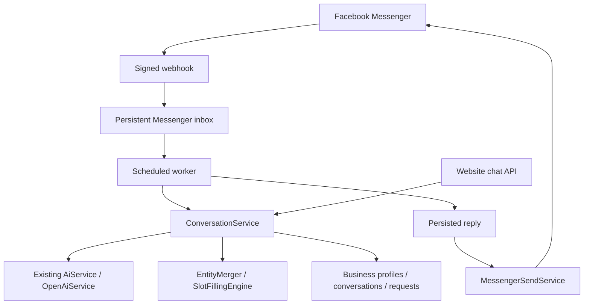

# Inquiro

Inquiro, by Vorlent Labs, is an AI receptionist for small businesses: answer customer questions, collect booking details, and route requests for confirmation. The initial target industries are hotels, restaurants, and clinics.

This repository contains the Spring Boot backend. The current implementation milestone is a secure Messenger round trip through the existing conversation engine. It is **not yet the complete commercial SaaS MVP**. See [IMPLEMENTATION_CHECKLIST.md](IMPLEMENTATION_CHECKLIST.md) for the evidence-based inventory and remaining work.

## What works here

- AI intent/entity extraction, contextual follow-ups, explicit corrections, configured missing-field questions, and business knowledge answers.
- Persistent business profiles, channel mappings, conversation state, and business requests awaiting confirmation/review.
- Messenger verification, raw-body signature checks, all text events in each batch, durable receipt before acknowledgment, duplicate protection, saved replies, retryable delivery, and optional typing/seen indicators.
- Scoped conversation identity: business + channel + external Page/site + customer. Website chat and Messenger share the same conversation service.
- Website message/reset endpoint compatibility. No frontend source, landing page, localStorage code, or browser daily-limit code is present in this checkout.

Availability currently means that a configured service is offered; it does **not** represent inventory. A completed conversation creates a business request, not an automatically confirmed reservation. Natural dates remain phrases until the inventory/date-normalization milestone.

## Architecture and stack

Java 17 target; Spring Boot 3.5.15-SNAPSHOT; Spring MVC, Spring Data JPA, Jackson, Lombok; H2 development database; Maven; OpenAI via Spring RestClient.



The webhook performs no AI calls. The worker saves conversation updates and its reply in one database transaction, then sends the saved reply in a separate transaction. Delivery retries do not repeat AI processing or create another business request.

## Run locally

Install a JDK (17 or newer), set `JAVA_HOME`, and configure environment variables in your shell or IDE run configuration. Spring does not automatically load `.env`; [.env.example](.env.example) lists placeholders only.

Windows PowerShell:

```powershell
.\mvnw.cmd test
.\mvnw.cmd package
java -jar target/inquiro-backend-0.0.1-SNAPSHOT.jar
```

macOS/Linux:

```sh
./mvnw test
./mvnw package
java -jar target/inquiro-backend-0.0.1-SNAPSHOT.jar
```

An installed Maven can also run `mvn test` and `mvn package`. The app starts without channel/AI credentials; corresponding external features require configuration. Credentials must never be passed in URLs or committed to Git.

## Environment variables

| Variable | Purpose / default |
| --- | --- |
| `OPENAI_API_KEY` | AI credential; legacy `INQUIRO_OPENAI_API_KEY` also accepted |
| `OPENAI_MODEL` | Defaults to `gpt-4.1-mini` |
| `FACEBOOK_VERIFY_TOKEN` | Random verification token; legacy `INQUIRO_MESSENGER_VERIFY_TOKEN` accepted |
| `FACEBOOK_PAGE_ACCESS_TOKEN` | Token for the configured Page; legacy `INQUIRO_MESSENGER_ACCESS_TOKEN` accepted |
| `FACEBOOK_PAGE_ID` | Numeric Facebook Page ID, required for Messenger |
| `FACEBOOK_APP_SECRET` | Meta App Secret for validating POST signatures |
| `FACEBOOK_GRAPH_API_VERSION` | Defaults to existing `v26.0`; set the version supported by your Meta app |
| `INQUIRO_MANAGEMENT_API_KEY` | Long random operator key for management API access |
| `DEFAULT_BUSINESS_ID` | Defaults to `biz_001` |
| `WEBSITE_CHANNEL_ID` | Defaults to `website-default` |
| `SEED_DEFAULT_BUSINESS` | Defaults to `true`; seeds missing default account and configured channel mappings |
| `MESSENGER_WORKER_ENABLED` | Defaults to `true`; use only one active worker instance for this milestone |
| `PORT` | Defaults to `8080` |
| `FORWARD_HEADERS_STRATEGY` | Defaults to `none`; set `native` only behind a trusted proxy which sanitizes headers |
| `DATABASE_URL` | JDBC URL; defaults to `jdbc:h2:file:./data/inquiro` |
| `DATABASE_USERNAME`, `DATABASE_PASSWORD` | Default development values: `sa`, blank password |
| `DATABASE_DDL_AUTO` | Defaults to `update` for development |
| `H2_CONSOLE_ENABLED` | Defaults to `false` |

Optional legacy WhatsApp settings are listed in `.env.example`. Its App Secret can be set with `WHATSAPP_APP_SECRET`; otherwise `FACEBOOK_APP_SECRET` is used. There is no JWT setting yet because business-user authentication is a later milestone.

The operator key protects `/api/business/**`, `/api/knowledge/**`, `/api/test/**` and the optional H2 console. Supply it in `X-Inquiro-Management-Key`. With no key configured, management access is denied. This is a single-operator pilot control, **not** business-user authentication or tenant authorization; never distribute this key to customers or embed it in public frontend code.

## Configure a business for the demo

Startup preserves existing business data. The repository's legacy default profile is a vehicle-service example; it is not silently replaced with a hotel.

Use `PUT /api/business/accounts/{businessId}/profile` to configure the full profile, including authoritative knowledge and service definitions. [examples/hotel-profile.json](examples/hotel-profile.json) is a fictional hotel fixture with room booking and airport pickup. Replace its facts with verified owner information before a real demonstration.

```powershell
$headers = @{ 'X-Inquiro-Management-Key' = $env:INQUIRO_MANAGEMENT_API_KEY }
$profile = Get-Content examples/hotel-profile.json -Raw
Invoke-RestMethod -Method Put -Uri 'http://localhost:8080/api/business/accounts/biz_001/profile' -Headers $headers -ContentType 'application/json' -Body $profile
```

Required slots and customer-facing questions come from each `RequestDefinition`. Restaurant and healthcare profiles can configure `TABLE_RESERVATION`, `BUFFET_RESERVATION`, and `DOCTOR_APPOINTMENT` in the same format. Real table/doctor/room inventory is still pending.

When seeding is enabled, `FACEBOOK_PAGE_ID` is mapped to `DEFAULT_BUSINESS_ID` if the Page has no existing mapping. Existing Page ownership is not overwritten. Verify the mapping with `GET /api/business/accounts/{businessId}/channels` before subscribing the Page. With seeding disabled, create the account and channel through the protected management endpoints.

## Connect Facebook Messenger

1. In the existing **Inquiro AI** Meta app, configure the Page ID, Page Access Token, verify token, App Secret, and Graph API version in the backend environment. Restart after changing them.
2. Expose the backend through a public **HTTPS** URL using your hosting platform or a development tunnel. HTTPS terminates at the trusted ingress; local Spring HTTP can remain private behind it.
3. Set the Messenger callback URL to `https://YOUR-BACKEND/webhook`. `/messenger/webhook` remains a compatible explicit Messenger URL.
4. Enter the same verify token as `FACEBOOK_VERIFY_TOKEN`. The GET handshake requires `hub.mode=subscribe`, the matching token, and `hub.challenge`; invalid verification returns 403.
5. Subscribe the app/Page to message events and enable the necessary Page messaging access. Confirm test-user/app-role eligibility in development mode; public access requires the applicable Meta review/access configuration.
6. Send a text message to that Facebook Page from a real eligible account. Check for an Inquiro reply and the `messenger_reply_sent` log event.
7. Test a follow-up, correction, knowledge question and another follow-up. An unfinished booking should survive the knowledge question.

The Send API uses `POST /{version}/{pageId}/messages`, a bearer token and `messaging_type: RESPONSE`. See [Meta's maintained Messenger API collection](https://www.postman.com/meta/messenger-platform-api/documentation/iyp204x/messenger-platform-api) for its request contract. Follow the app's current messaging-window and permission requirements; Inquiro does not bypass Meta restrictions.

POST bodies are checked against `X-Hub-Signature-256` using the App Secret before processing. Unsigned requests are rejected even in development. A valid verify token is not a substitute for a POST signature. The shared `/webhook` also preserves existing WhatsApp routing by object type; its explicit route is `/whatsapp/webhook`.

Only the configured Messenger Page's token is used. Events from unknown, disabled, or unconfigured Pages are ignored. Multiple business records and isolated conversation keys exist, but self-service authorization and per-tenant token storage are future work.

## Website compatibility and REST endpoints

The existing message payload remains unchanged:

```http
POST /api/conversations/message
Content-Type: application/json

{"sessionId":"browser-generated-session-id","message":"I need a room in Paris"}
```

Responses retain `inquiry`, `missingFields`, `status`, and `reply`. `DELETE /api/conversations/{sessionId}` resets only the configured website conversation. `POST /api/chat` remains available as the existing stateless/default-profile endpoint.

| Endpoint | Purpose |
| --- | --- |
| `GET/POST /webhook` | Shared Meta callback, including Messenger |
| `GET/POST /messenger/webhook` | Explicit Messenger callback |
| `GET/POST /whatsapp/webhook` | Explicit legacy WhatsApp callback |
| `POST /api/conversations/message` | Stateful website chat |
| `DELETE /api/conversations/{sessionId}` | Website reset |
| `POST /api/chat` | Existing stateless chat |
| `POST /api/business/accounts` | Create business account; operator key required |
| `GET/PUT /api/business/accounts/{id}/profile` | Read/update profile |
| `GET/POST /api/business/accounts/{id}/channels` | Read/add channel mapping |
| `GET /api/business/requests?businessId=...` | Requests for a business |
| `GET /api/business/requests/pending?businessId=...` | Pending requests |
| `POST /api/business/requests/{id}/confirm` or `/reject` | Existing manual request decision |
| `GET /api/business/accounts/{id}/messenger/events?status=FAILED` | Last 50 event summaries for the business |
| `POST /api/business/accounts/{id}/messenger/events/{eventId}/retry` | Retry a failed event after resolving its configuration/error |

The browser's existing localStorage identifier can still be sent unchanged. Historical unscoped database conversation rows are retained but not reused: their tenant/channel provenance cannot be established safely. In-progress legacy conversations therefore start afresh once after this update. New sessions persist with explicit scope metadata. Existing local database files are not migrated destructively or included in implementation commits.

## Delivery operations and limitations

- All text events in all entries are inspected. Echoes, receipts, attachments and malformed events are ignored safely.
- Deduplication uses Page + message ID and a unique database constraint. If the ID is absent, a timestamp/sender/text fallback is used. Without both ID and timestamp, duplicate detection cannot be guaranteed.
- The scheduled worker consumes at most 20 eligible rows per poll. Use **one worker instance** to preserve conversation ordering; distributed per-conversation ordering is not yet implemented.
- AI failures produce a friendly saved reply. Seen/typing failures do not prevent a reply attempt.
- Send failures retry with backoff, up to five attempts. Permanent HTTP errors and exhausted retries become `FAILED`; operators can inspect safe summaries and retry after correcting the cause.
- A crash after Meta accepted a reply but before the database recorded success can cause an outbound duplicate. There is no atomic transaction spanning Meta and the database. This implementation does not claim exactly-once external delivery.
- Replies are bounded to 2,000 Unicode code points. Incoming text is bounded to 10,000 characters; webhook bodies are bounded to 1 MiB at the controller. Enforce a request-body limit at the ingress too.
- Logs contain request/event identifiers and status, not tokens, verification query strings or raw customer messages. Inbox/conversation records contain customer data; restrict database access and define retention before onboarding real customers.
- Manual business-decision notifications use the original Messenger identity; website requests are never sent as Messenger messages. These legacy decision notifications are best effort and are not in the webhook reply retry queue.

## Tests and validation

`mvn test` uses an isolated in-memory H2 database and mocked external HTTP; no real credentials or messages are required. Coverage includes AI JSON parsing, contextual multi-field extraction/merging, correction handling, question interruption, Page/channel isolation, webhook verification/signatures, batch parsing, Send API requests, concurrent deduplication, durable reply retry, operator access, notification routing, and website reset compatibility.

See [VALIDATION.md](VALIDATION.md) for actual build and smoke-test results. Real Meta delivery is a separate external acceptance check; a mocked send test does not prove it.

## Pilot deployment and remaining production work

Build the executable jar or the supplied `Dockerfile`. The container runs as a non-root user and listens on 8080. Supply secrets at runtime. For an H2 pilot, persist `/app/data` on a volume writable by UID 10001 and use one instance. The Docker image must be built/tested in your deployment environment; its execution is not implied by the Maven build.

Place Cloudflare or another HTTPS ingress before the backend, keep the origin private, apply request-size/rate limits, and restrict management access. Never expose the H2 console publicly. Back up H2 while the application is stopped and test restoring the copy. Preserve the database containing the inbox during redeployment so pending replies/deduplication survive.

Before production SaaS rollout: add PostgreSQL driver/schema migrations (legacy CLOB mappings need conversion), business-user authentication/authorization, tenant-scoped management, encrypted per-Page credentials and Meta authorization, database inventory and confirmed bookings, backend rate/usage limits, retention/monitoring, backup/restore verification, and a dashboard/frontend. Pin the current SNAPSHOT parent to a tested stable release. PostgreSQL compatibility, horizontal scaling, billing and deployment to a public host are not claimed by this milestone.

Persistent FAQ approval and owner onboarding are the next implementation milestones after Messenger acceptance. The current knowledge-ingestion API still has the legacy in-memory/conditional-persistence limitation; use the persistent profile endpoint for this Messenger demonstration.
